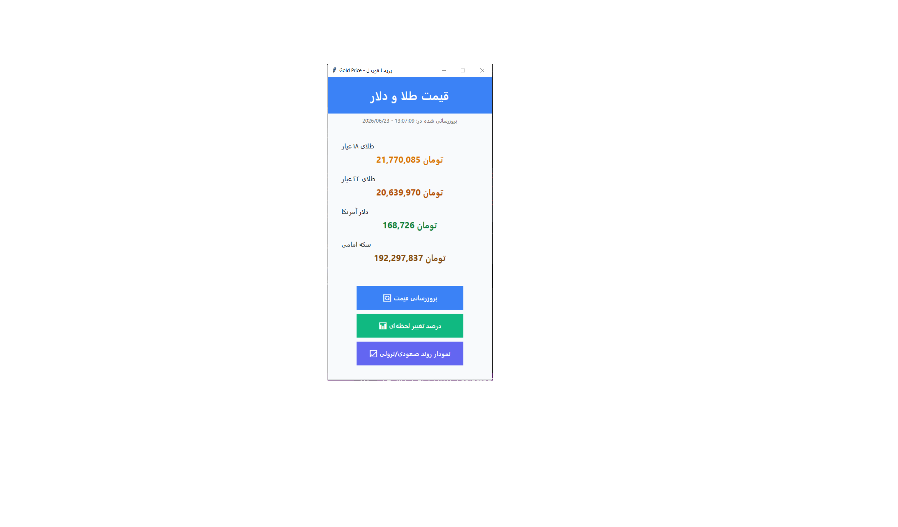

# Gold & Dollar Price Tracker

A desktop application designed to monitor and analyze gold and currency prices (Gold 18K/24K, Dollar, Emami Coin). This project was developed as an undergraduate CS project to practice GUI development and data visualization.

## 💡 Key Features
- **Data-Driven Analysis:** Uses Python and Pandas to manage and process price datasets.
- **Offline Data Integration:** Due to limited internet access during development, the system is designed to read and analyze data directly from local Excel (`.xlsx`) files.
- **Visual Trends:** Includes interactive Matplotlib charts to visualize real-time price changes and historical trends.
- **Modern GUI:** Built with Tkinter, featuring a custom Splash Screen and a clean, user-friendly interface.

## 🛠 Technologies Used
- **Language:** Python
- **GUI:** Tkinter
- **Data Manipulation:** Pandas
- **Visualization:** Matplotlib
- **Standard Libraries:** OS, Datetime, Random

## 🚀 How to Run
1. Ensure you have Python installed.
2. Install required libraries:
```bash
   pip install pandas matplotlib
   python app.py
 

## 🎓 About the Project
This project was part of my Computer Science undergraduate curriculum, focusing on creating an end-to-end desktop solution for financial tracking.

## 📸 Project Preview

